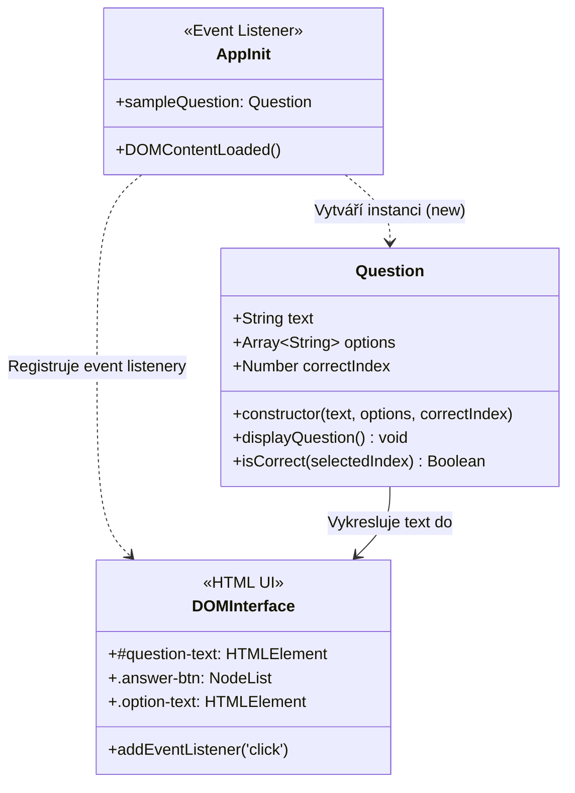

# 🧠 QuizApp v1: Prototyp a Základní Rozhraní

Výukový prototyp modulární webové kvízové aplikace zaměřený na základy sémantického HTML5, přístupný Flexbox layout (A11y, WCAG AA) a objektově orientované programování (OOP) v moderním JavaScriptu (ES6+).

Tato fáze představuje **1. stavební kámen (vyhovující prototyp)**, na kterém studenti pochopí, jak oddělit strukturu (HTML), vzhled (CSS) a aplikační logiku reprezentovanou samostatnou třídou `Question`.

---

## 🎯 Klíčová témata a výukové cíle

* **Sémantický HTML5 layout**: Využití tagů `<header>`, `<main>`, `<section>`, `<article>`, `<button>` a `<aside>`.
* **Přístupnost (A11y & WCAG AA)**:
  * Splnění kontrastních poměrů (minimálně 4.5:1, zde > 7:1).
  * Velké klikatelné plochy pro dotyková zařízení (výška tlačítek > 44 px).
  * Výrazné vizuální stavy při navigaci klávesnicí (`:focus-visible`).
* **Moderní CSS Flexbox & CSS proměnné (Design Tokens)**:
  * Vertikální a horizontální centrování prvků.
  * Pružná dvousloupcová mřížka odpovědí pro větší obrazovky.
  * Interaktivní stavy `:hover` a `:active` s plynulými přechody (`transition`).
* **Objektově orientovaný JavaScript (ES6+ OOP)**:
  * Definice třídy `Question` a jejího konstruktoru (`constructor`).
  * Zapouzdření dat otázky (text, možnosti, index správné odpovědi).
  * Metoda `displayQuestion()` pro bezpečný zápis do DOMu přes `.textContent`.
  * Metoda `isCorrect(selectedIndex)` pro vyhodnocení volby.
* **Událostní model DOM**:
  * Registrace posluchačů `click` událostí na tlačítka pomocí `querySelectorAll` a `forEach`.
  * Předání vyhodnocení do vývojářské konzole prohlížeče (`console.log`).

---

## 📐 Architektura Aplikace (UML Diagram)



---

## 🧩 Struktura Projektu

```text
quiz-app-v1-prototype/
├── index.html            # Vstupní sémantická stránka s licenční hlavičkou a zadáním
├── styles.css            # Referenční produkční styly (Flexbox, A11y, Design Tokens)
├── styles-students.css   # Pracovní verze stylů s číslovanými TODO úkoly a nápovědami
├── script.js             # Referenční JavaScript logika s OOP třídou Question
├── script-students.js    # Pracovní verze JS s kostrou, TODO úkoly a syntax hints
├── LICENSE               # Plný text licence GNU AGPL-3.0
├── README.md             # Tento didaktický průvodce a dokumentace architektury
└── docs/                 # Výchozí podklady a tahák pro výuku
    ├── quiz-app-v1-prototype.md
    └── zaklady-HTML-Flexbox-OOP-JS-tahak.md
```

---

## 🚀 Jak s projektem pracovat

### 1. Spuštění aplikace
1. Otevřete soubor `index.html` v libovolném moderním webovém prohlížeči (nebo použijte rozšíření *Live Server* ve VS Code).
2. Otevřete vývojářské nástroje prohlížeče (klávesová zkratka `F12` nebo `Ctrl + Shift + I` / `Cmd + Option + I`) a přejděte na záložku **Console**.
3. Klikněte na jednotlivá tlačítka odpovědí a sledujte vyhodnocení v konzoli.

### 2. Přepnutí na studentskou pracovní verzi
V souboru `index.html` přepněte odkazy v komentářích:

* **Pro přepnutí stylů** v sekci `<head>`:
  ```html
  <!-- <link rel="stylesheet" href="styles.css"> -->
  <link rel="stylesheet" href="styles-students.css">
  ```
* **Pro přepnutí skriptu** před koncem `</body>`:
  ```html
  <!-- <script src="script.js"></script> -->
  <script src="script-students.js"></script>
  ```
* Postupujte podle číslovaných úkolů `TODO 1` až `TODO 10` v souboru `styles-students.css` a `TODO 1` až `TODO 5` v souboru `script-students.js`.

---

## 🎯 Co se student naučí

1. **Psát sémantický a bezpečný kód**: Pochopí rozdíl mezi `textContent` a `innerHTML`, vyhne se bezpečnostním chybám typu XSS a zvládne čistou sémantiku.
2. **Budovat přístupná uživatelská rozhraní**: Dokáže navrhnout barevnou paletu splňující WCAG standardy a zajistit ovládání klávesnicí.
3. **Ovládat Flexbox**: Dokáže vycentrovat obsah, rozvrhnout karty a vytvořit responzivní mřížku pro tlačítka bez zbytečných knihoven.
4. **Přemýšlet objektově (OOP)**: Naučí se zapouzdřit stav a chování do třídy `Question`, oddělit data od prezentace v DOM a pracovat s konstruktorem a instancemi.
5. **Obsluhovat DOM události**: Připojit posluchače na kolekci prvků, číst HTML5 `data-*` atributy a reagovat na uživatelský vstup.

---

## ⚙️ Použité technologie & Požadavky

* **HTML5**: Sémantické značení, přístupnostní atributy (ARIA).
* **CSS3**: Flexbox layout, CSS Custom Properties (`var(--...)`), Media Queries, přístupnostní pseudo-třídy (`:focus-visible`).
* **JavaScript**: ECMAScript 2020+ (Class syntax, Arrow functions, Template literals, DOM API).
* **Podporované prohlížeče**: Libovolný moderní prohlížeč (Chrome, Edge, Firefox, Safari) s podporou ES6 bez nutnosti instalace dalších buildovacích nástrojů.

---

## 👤 Autor a Licencování

**Autor:** Jakub Březa (Vlk samotář) – [VlkSamotar.cz](https://vlksamotar.cz) | Informatika | Trading | Elektrotechnika 

---

## 📜 Licence & Komerční využití

Tento projekt je šířen pod licencí **GNU Affero General Public License v3 (AGPL-3.0)** (viz přiložený soubor [LICENSE](LICENSE)).

### Co to znamená?
* **Pro studenty a samouky:** Projekt můžete volně používat, studovat a upravovat pro své osobní účely.
* **Pro lektory a vzdělávací organizace:** Můžete projekt využít při výuce, ale **pokud aplikaci (nebo její upravenou verzi) provozujete na síti/webu, musíte zachovat zdrojový kód otevřený pod stejnou licencí AGPL-3.0** a uvést původního autora.

### 💼 Máte zájem o komerční využití bez omezení AGPL?
Pokud chcete tento interaktivní playground integrovat do své komerční (uzavřené) platformy, e-learningu nebo máte zájem o white-label řešení pro vaši školu, kontaktujte mě na [VlkSamotar.cz](https://vlksamotar.cz) pro sjednání **komerční proprietární licence**.

---

## 🧩 Třetí strany a závislosti

* **Google Fonts (Lexend, Roboto)**: Šířeno pod otevřenou licencí [SIL Open Font License 1.1](https://openfontlicense.org/).
* Projekt nevyžaduje žádné externí npm balíčky, runtime frameworky ani bundlery.
